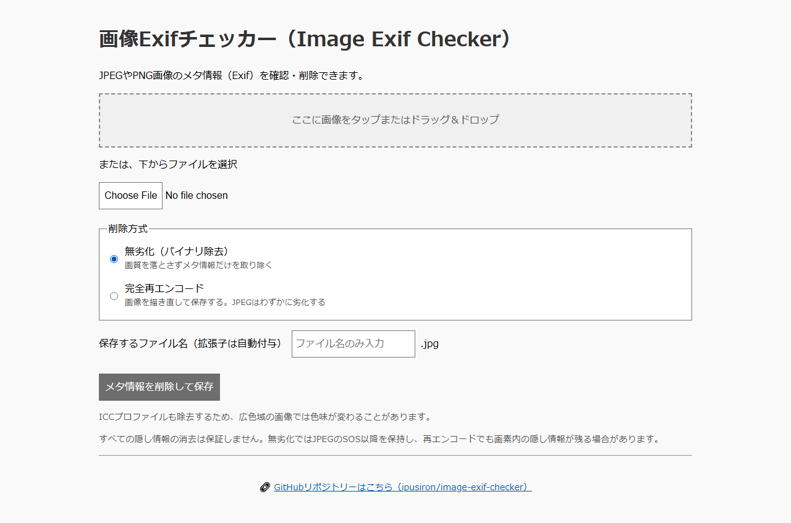
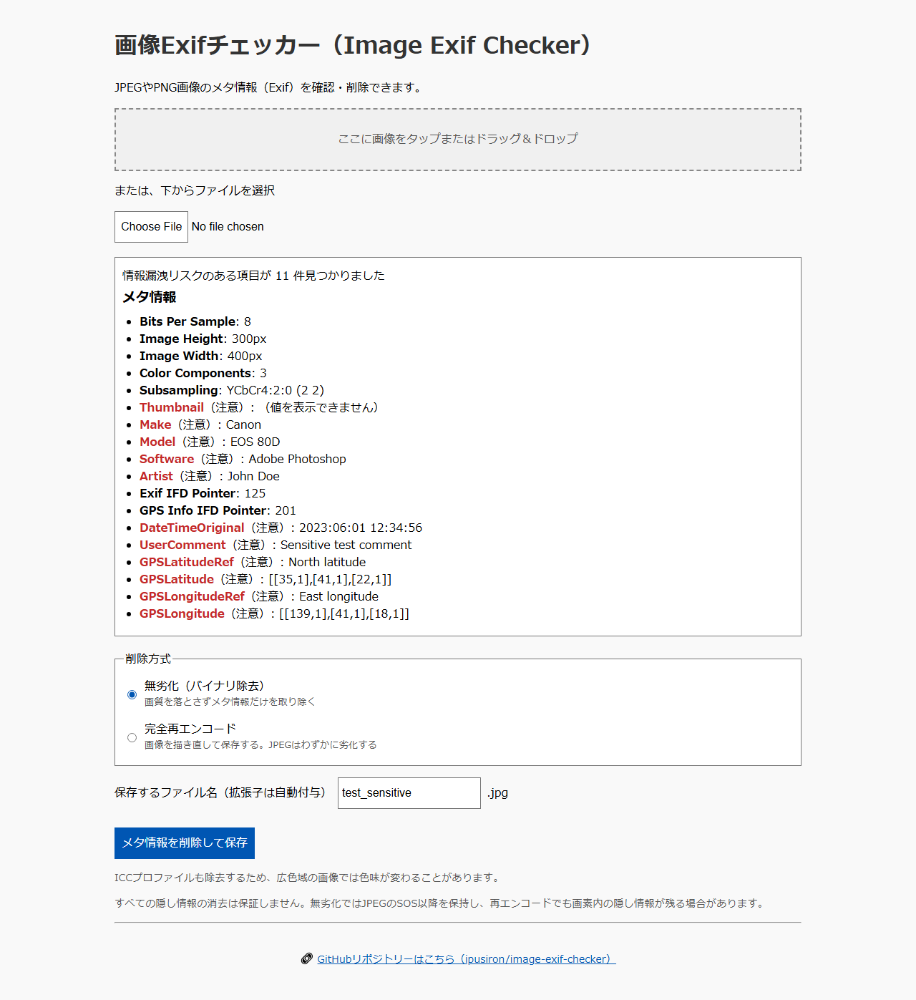
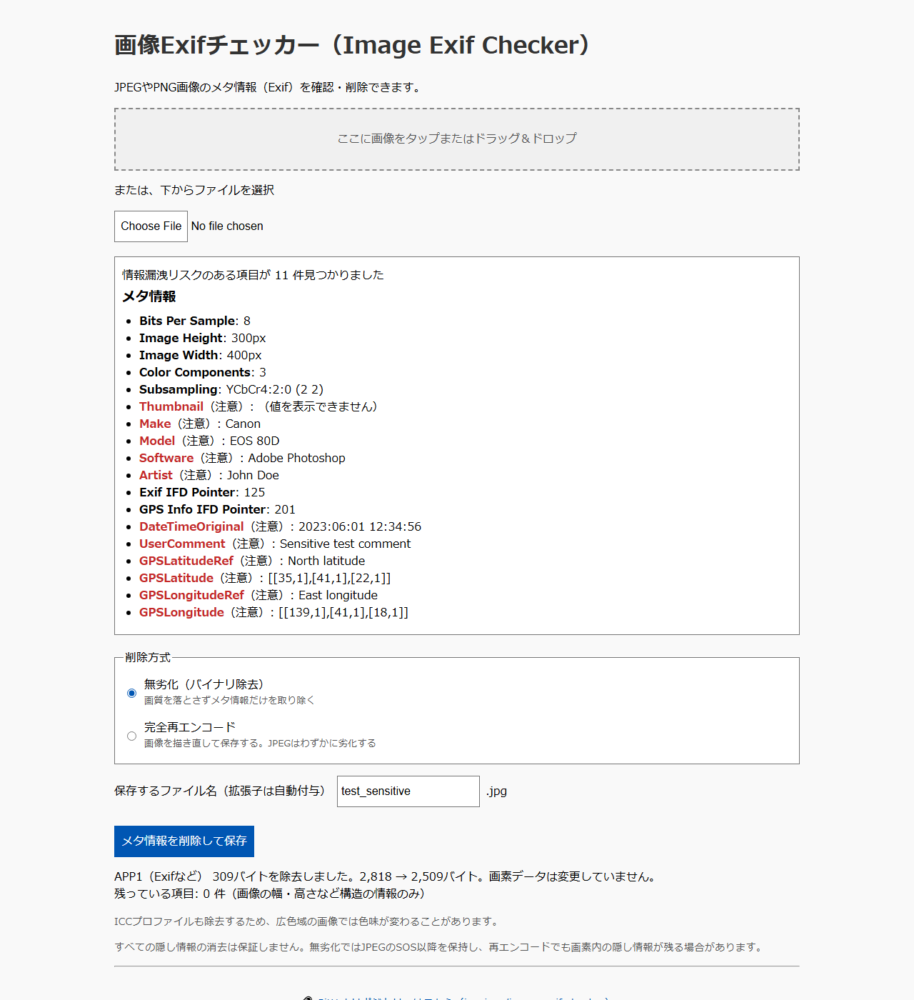
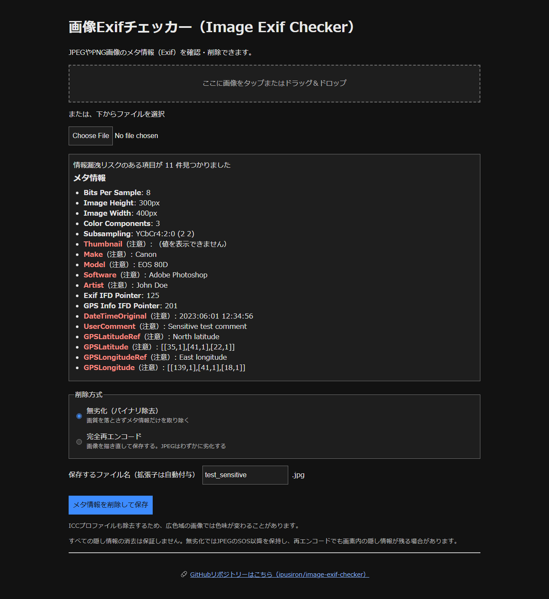
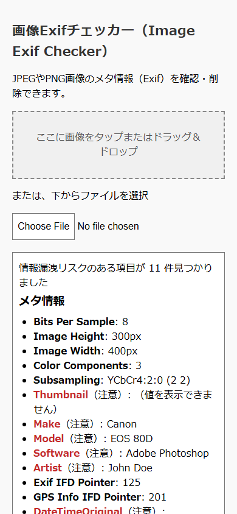

# Image Exif Checker

English · [日本語](README.md)


[](https://ipusiron.github.io/image-exif-checker/)

**Day007 - 100 Security Tools with Generative AI**

**Image Exif Checker** is a web tool that shows you the Exif metadata inside a JPEG or PNG image and removes it.
It reveals the location, the capture time and the other traces hidden in a picture, and strips them with one button.
The default is lossless removal, which never recompresses the pixel data. Full re-encoding through a canvas is also available.

## 🌐 Demo

👉 [https://ipusiron.github.io/image-exif-checker/](https://ipusiron.github.io/image-exif-checker/)

## 📸 Screenshots

The screenshots below are taken from the running tool (the Japanese interface).

<p align="center">
  
</p>

> *The initial screen, with the file picker and the two removal methods.*

<p align="center">
  
</p>

> *The 11 sensitive tags of the sample are shown as a count and in red.*

<p align="center">
  
</p>

> *309 bytes of APP1 are removed, and the re-check confirms that no sensitive tag remains.*

<p align="center">
  
</p>

> *Dark mode highlights the sensitive tags in red as well.*

<p align="center">
  
</p>

> *On a phone, a long value wraps instead of overflowing.*

## ✨ Features

- Everything runs in the browser. No image is uploaded anywhere
- A privacy check before you post a picture on social media
- A count of the sensitive tags, with location, time, equipment, author and thumbnail highlighted
- A choice between lossless removal and full re-encoding, plus a re-check of the saved file
- Light and dark themes, keyboard operation and a mobile layout
- Japanese and English, switchable in place. `?lang=ja` and `?lang=en` also work

### Supported formats

- JPEG files (.jpg, .jpeg)
- PNG files (.png)

## 📖 How to use

1. Open the demo page in a web browser.
2. Tap the drop zone, or pick a JPEG or PNG with the file input or by dragging it in.
3. Read the count and the items shown in red, then choose a removal method and a file name.
4. Press **Remove the metadata and save**, and check the result and the saved image.

The drop zone is reachable with Tab and opens with Enter or Space.
A damaged file or an unsupported format shows an error in the language you are reading, and you can pick another file right away.
Choosing the same file again re-runs the analysis.
The button next to the heading switches between Japanese and English. A result already on screen is not cleared: it is translated in place.

## 📐 Layout

- Next to the heading: the language switch
- Top: the drop zone and the file input
- Middle: the count of sensitive tags and the list of metadata
- Bottom: the removal method, the file name, the save button, and the removal and re-check results

## 🎯 Use cases

Ways of using this tool in particular

- Spotting a mismatch between the extension and the content (a lesson on file signatures): this tool decides the format from the leading bytes, not from the extension. JPEG starts with `FF D8 FF` and PNG with `89 50 4E 47 0D 0A 1A 0A`. An image named `photo.png` whose content is JPEG is saved as `photo.png.jpg`, so a file that was only renamed stands out. Check other formats with [MagicSign Inspector](https://ipusiron.github.io/magic-sign-inspector/) (Day040)
- Making a copy for publication without changing the image quality: people who publish photos for a library, a museum or a PR team make a copy that removes only the metadata segments, without recompressing. In the fixed sample, 309 of 2,818 bytes (11.0%) are removed, and the image data itself is left as it is
- Counting what remains in a photo you received: journalists and researchers check whether a supplied photo still carries the capture time, the camera model or the location. In the fixed sample, 11 of its 18 tags are highlighted as sensitive. If they remain, they are a lead for checking the place and time of the shot with [WhereShot](https://ipusiron.github.io/whereshot/) (Day013) (if they are gone, that alone does not prove editing; the service or app used for posting may remove them)

General uses

- Checking the location and the capture time before a post goes public
- Removing the author, the equipment and the embedded thumbnail before sharing a photo
- Learning how Exif and the PNG text chunks affect privacy

## 🔬 How it works

### Removal methods

| Method | Processing | Image quality |
| --- | --- | --- |
| Lossless (binary removal) | Drops the metadata segments and chunks | The pixel data is not recompressed |
| Full re-encoding | Redraws on a canvas and saves in the original format | JPEG is recompressed at quality 0.95, PNG stays lossless |

The result of lossless removal on the fixed sample `test/test_sensitive.jpg` is as follows.

| File | Input bytes | Output bytes | Removed bytes |
| --- | ---: | ---: | ---: |
| test/test_sensitive.jpg | 2,818 | 2,509 | 309 |

For a JPEG, the markers from SOI up to the first SOS are read, and APP0 through APP15 and COM are dropped.
After the SOS header is written out, the remaining bytes are copied without being interpreted.
For a PNG, IHDR, IDAT, IEND, the palette, the transparency, the animation chunks and the chunks needed for display are copied with their CRC.
cICP, mDCV and cLLI for HDR display are kept as well. Chunk names are case sensitive.
tEXt, zTXt, iTXt, eXIf, tIME, dSIG, iCCP and unknown chunks are dropped.
"Lossless" means the compressed pixel data is untouched. It does not promise that the look of the image is unchanged, because removing ICC or Orientation can alter it.

### ✅ The flow

1. Read the image file (JPEG or PNG), then check its leading bytes, its structure and that the browser can decode it.
2. Parse the metadata with ExifReader and highlight the sensitive tags.
3. Build the output blob with the chosen removal method.
4. Re-check the output with ExifReader, show the result, and download the image.

### 🔍 Extracting the Exif data

The tool parses the Exif metadata with the ExifReader library.
Version 4.12.0 is bundled under `vendor/exifreader/` and loaded without any CDN.

An image file (JPEG or PNG) is read as binary, and the Exif data is extracted like this.

```javascript
const arrayBuffer = await file.arrayBuffer();
const tags = ExifReader.load(arrayBuffer);
```

- `file.arrayBuffer()` gives the binary content of the image file
- `ExifReader.load()` extracts the tags in the Exif area (camera name, capture time, GPS coordinates and so on)

The extracted data is shown on the page through `description` or `value`, so that you can see what personal information is inside before you remove it.
A tag name is uppercased with every non-alphanumeric character stripped, and then compared against the list.
A tag whose value cannot be shown reads "(this value cannot be shown)". Control characters are dropped, and a value longer than 200 characters is truncated with its length attached.

Exif tag names such as `Make`, `Model`, `GPSLatitude` and `DateTimeOriginal` are proper nouns defined by the specification, so they are never translated.
Only the interface text is.

### 🧹 The main information highlighted as sensitive

| Category | Examples |
| ----- | -------------------------------------------- |
| Capture time | `DateTimeOriginal`, `DateTime`, `DateTimeDigitized` |
| Location | `GPSLatitude`, `GPSLatitudeRef`, `GPSLongitude`, `GPSLongitudeRef`, `GPSAltitude` |
| Camera | `Make`, `Model`, `LensModel` |
| Editing history | `Software` |
| Rights | `Copyright`, `Artist` |
| Other | `ImageDescription`, `UserComment`, `Thumbnail`, `Author`, `Comment` |

Highlighting is only the display. Every piece of metadata inside a removed segment or chunk is dropped, not just the highlighted tags.

### 📁 Output format

- A JPEG input is saved as a JPEG (.jpg) after removal
- A PNG input is saved as a PNG (.png) with its transparency intact

The format is decided by the leading bytes, not by the MIME type or the extension.
Forbidden characters and control characters are stripped from the file name, which is capped at 100 characters. A duplicate extension is avoided, including in uppercase.

### 🔧 Removal by redrawing on a canvas

With full re-encoding, the Exif data goes away because the image is drawn on a canvas, regenerated as a blob and then saved.

```javascript
canvas.toBlob((blob) => {
  // save the new image
}, "image/jpeg", 0.95);
```

A PNG is saved as `image/png` with no quality argument.
A failure to load the image or to generate the blob is handled, and every object URL is revoked after the load or the save.

## 🔒 Security

The image is processed inside the browser. Nothing is sent to an external API or a CDN.
The only thing kept in localStorage is your language choice (`image-exif-checker-language`). No image and no metadata is stored, and no cookie is used.
Values are shown with `textContent` or `createTextNode`.

```text
default-src 'self'; script-src 'self'; style-src 'self';
img-src 'self' blob: data:; connect-src 'none'; font-src 'self';
object-src 'none'; media-src 'none'; frame-src 'none';
base-uri 'self'; form-action 'none';
```

`frame-ancestors` has no effect in a meta CSP, so it is not declared.
GitHub Pages cannot set arbitrary HTTP response headers, so this deployment cannot guarantee that the page is never framed.
No script forces the parent page to navigate.
`referrer` is `no-referrer`, so no referrer is sent to an external link.

## ⚠️ Caveats

- The ICC profile (APP2 in a JPEG, iCCP in a PNG) is removed too, so the colors of a wide-gamut image may shift.
- Removing Orientation can change the direction in which the image is displayed.
- A PNG can carry metadata in the standard eXIf chunk or in a text chunk. This tool removes those as well.
- Watch out for caches in the browser and in social apps, and check the saved file again.

Redrawing on a canvas recompresses the image, so a JPEG may lose a small amount of quality (quality: 0.95).
Lossless removal keeps the animation chunks of an APNG, but redrawing on a canvas turns it into a still image.

Removal of every hidden piece of information is not guaranteed.
Lossless removal of a JPEG keeps everything after the first SOS as it is, so extra data inside that range or at the end of the file is not removed.
Even redrawing on a canvas cannot promise to erase information hidden in the pixels (steganography).
"Remaining items: 0" is the verdict on the sensitive tags. It does not mean the image holds no secret at all.

## 🧪 Tests

```sh
npm test
```

The tests use `node --test` on Node 22 or later, with no npm dependency to install.
GitHub Actions runs them on every push and pull request.
They check the sensitive tags, the displayed values, the file names, the byte-level removal result, the HTML, the colors, the formatting, and the numbers and image references in the README.
For the two languages they check that the key sets match, that the placeholders agree, that every key used by the HTML and the scripts exists, and that nothing is left untranslated in the English dictionary.

The **test files** below, under the `test` folder, are there to try the tool with.

### 🔹 `test_sensitive.jpg`

* A sample image with Exif data, included in this repository
* It carries risky Exif entries such as `GPSLatitude`, `DateTimeOriginal` and `Artist`

📌 Load this image into the tool and you can see those entries **highlighted in red**.

### 🔹 `generate_test_exif_image.ipynb`

* A Jupyter notebook for generating your own test image
* It builds a JPEG with arbitrary Exif data using `Pillow` and `piexif`

#### Steps (Google Colab)

1. Open [`generate_test_exif_image.ipynb`](./test/generate_test_exif_image.ipynb) in Colab.
2. Run the cells from the top.
3. Download the generated `test_sensitive.jpg` and load it into the tool.

The notebook installs the packages it needs to generate an image. Neither the app itself nor the Node tests need them.
The existing fixed sample is checked by SHA-256 in the tests, so do not overwrite it with a generated image.

## ❓ FAQ

### An image without metadata can still be saved

As long as the image can be read, it can be saved even with no metadata.
Structural tags such as width and height may remain, and that alone is not counted as a sensitive tag.

### What a PNG is saved as

A PNG input is saved as a PNG. It is never converted to a JPEG.

## 🔗 References

- [ExifReader source and documentation](https://github.com/mattiasw/ExifReader)
- [W3C PNG specification](https://www.w3.org/TR/png-3/)

## 📁 Directory structure

```text
image-exif-checker/
├── index.html                 # the input and result screen, the CSP
├── i18n.js                    # the Japanese and English dictionaries, the switch
├── exif-logic.js              # detection, display formatting, lossless removal
├── main.js                    # DOM, ExifReader, canvas and saving
├── style.css                  # colors, mobile, dark mode
├── vendor/exifreader/         # 4.12.0 itself, MPL-2.0, a README with the source
├── assets/                    # screenshot.png through screenshot5.png
├── test/
│   ├── exif-logic.test.js      # detection, values, file names
│   ├── strip.test.js           # byte-level removal result
│   ├── html.test.js            # HTML, the CSP and CI
│   ├── contrast.test.js        # contrast in light and dark
│   ├── readme.test.js          # YAML, tables, images, notebook
│   ├── format.test.js          # line length and readable formatting
│   ├── i18n.test.js            # dictionaries, the HTML mapping, missed translations
│   ├── test_sensitive.jpg      # the fixed sample image
│   └── generate_test_exif_image.ipynb # the image-generating notebook
├── .github/workflows/test.yml # the automated Node 22 tests
├── package.json               # the npm test definition
├── README.md / README.en.md   # the Japanese and English documentation
├── CLAUDE.md                  # development conventions
├── LICENSE                    # the MIT license
├── ss1.png / ss2.png           # old screenshots (kept)
└── ogp.png                    # the OGP image
```

## 💻 Requirements

- The latest Chrome, Edge, Firefox or Safari
- Served over HTTP, or `index.html` opened directly with file://
- Node 22 or later for the tests

## 📄 License

This project is released under the [MIT license](./LICENSE).
The bundled ExifReader is MPL-2.0. The full text is in [vendor/exifreader/LICENSE](./vendor/exifreader/LICENSE).

## 🛠️ About this tool

This tool was built as part of the project "100 Security Tools with Generative AI".

In that project, security-related tools are built and published over 100 days with the help of AI.

For the project and the other tools, see the page below.

🔗 [https://akademeia.info/?page_id=42163](https://akademeia.info/?page_id=42163)
