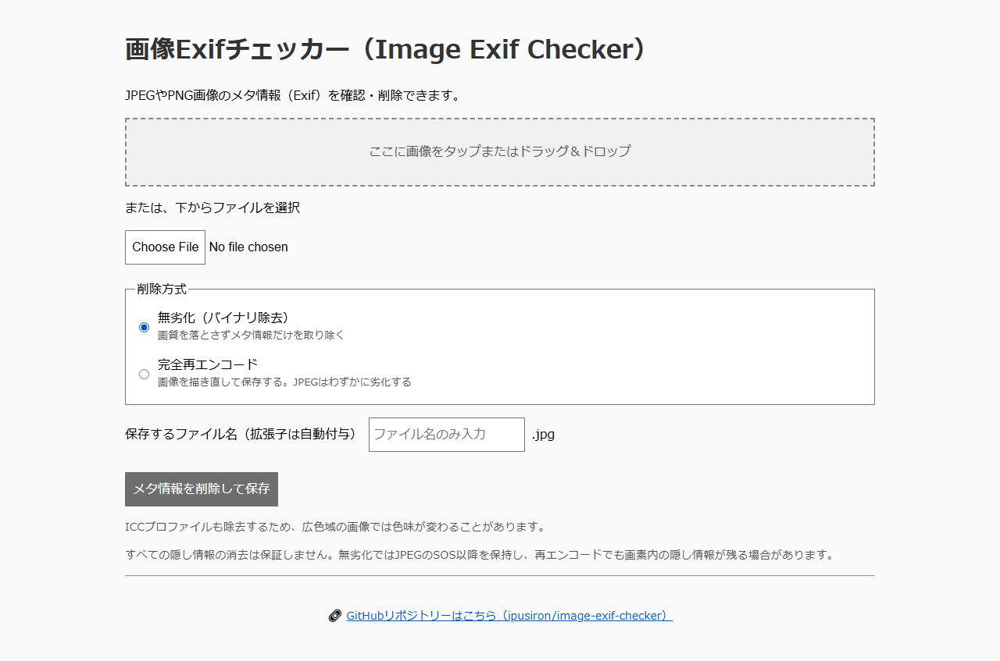
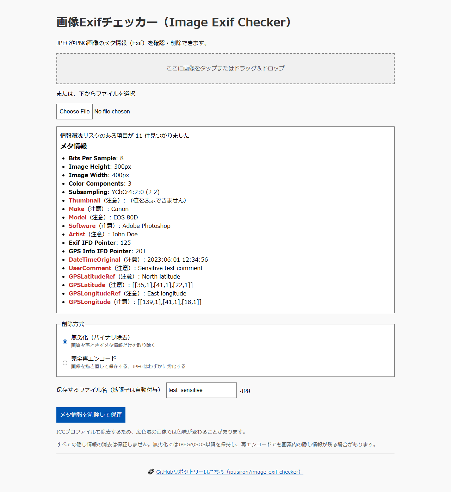
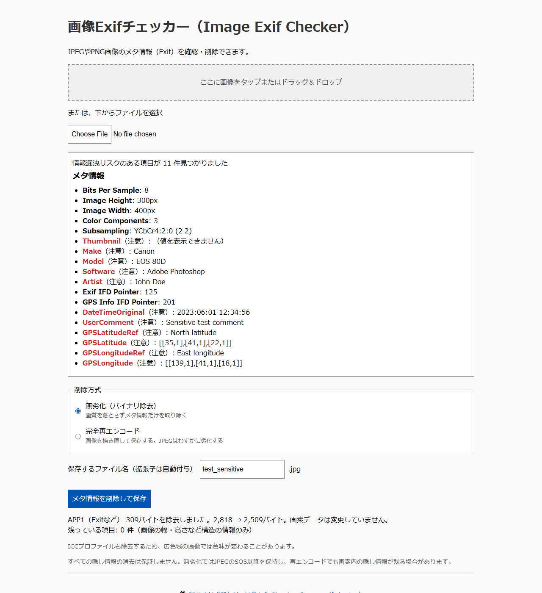
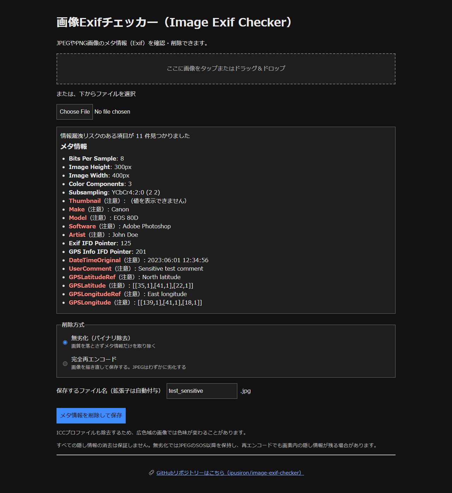
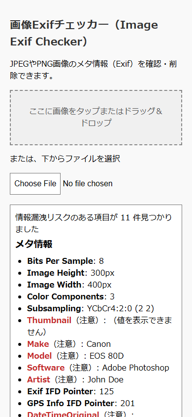

<!--
---
id: day007
slug: image-exif-checker

title: "画像Exifチェッカー"

subtitle_ja: "画像に潜む個人情報を可視化・削除"
subtitle_en: "Visualize and remove hidden metadata from images"

description_ja: "JPEG/PNG画像に含まれるExifメタ情報を確認・削除できるWebツール。位置情報や撮影日時などを可視化し、ボタン1つで除去できます。"
description_en: "A web tool to check and remove Exif metadata from JPEG/PNG images. Visualizes location data, timestamps, and more, with one-click removal."

category_ja:
  - フォレンジック
category_en:
  - Forensics

difficulty: 1

tags:
  - exif
  - metadata
  - privacy
  - image
  - security
  - metadata analysis

repo_url: "https://github.com/ipusiron/image-exif-checker"
demo_url: "https://ipusiron.github.io/image-exif-checker/"

hub: true
---
-->

# 画像Exifチェッカー（Image Exif Checker）


[](https://ipusiron.github.io/image-exif-checker/)

**Day007 - 生成AIで作るセキュリティツール100**

**画像Exifチェッカー**は、JPEG/PNG画像に含まれるExifメタ情報を確認・削除できるWebツールです。  
画像に含まれる位置情報や撮影日時などを可視化し、ボタン1つで除去できます。
初期設定は画素データを再圧縮しない無劣化除去で、Canvasによる完全再エンコードも選べます。

## 🌐 デモページ

👉 [https://ipusiron.github.io/image-exif-checker/](https://ipusiron.github.io/image-exif-checker/)

## 📸 スクリーンショット

以下は実際の画面例です。

<p align="center">
  
</p>

> *画像選択と2つの削除方式を備えた初期画面です。*

<p align="center">
  
</p>

> *サンプルの機微タグ11件を、件数と赤い文字で表示します。*

<p align="center">
  
</p>

> *APP1の309バイトを除去し、残る機微タグが0件であることを再検証します。*

<p align="center">
  
</p>

> *ダークモードでも機微タグを赤色で強調します。*

<p align="center">
  
</p>

> *モバイルでは長い値を折り返して表示します。*

## ✨ 機能

- クライアントサイド完結の解析と保存。画像のアップロードなし
- SNS投稿前の個人情報漏洩リスクチェック
- 機微タグの件数表示と、位置情報、日時、機材、著作者、サムネイルの強調
- 無劣化除去と完全再エンコードの選択、除去後の再検証
- ライト／ダーク、キーボード操作、モバイル表示への対応

### 対応形式

- JPEGファイル（.jpg、.jpeg）
- PNGファイル（.png）

## 📖 使い方

1. デモページをWebブラウザーで開く。
2. ドロップゾーンをタップするか、ファイル選択またはドラッグ＆ドロップでJPEG/PNGを読み込む。
3. 件数と赤色の項目を確認し、削除方式と保存名を選ぶ。
4. 「メタ情報を削除して保存」を押し、結果と保存された画像を確認する。

ドロップゾーンはTabで選択し、EnterまたはSpaceでも開けます。
壊れた画像や未対応形式は日本語のエラーを表示し、続けて別のファイルを選択できます。
同じファイルを選び直した場合も再解析します。

## 📐 画面構成

- 上部：ドロップゾーンとファイル選択
- 中央：機微タグの件数とメタ情報の一覧
- 下部：削除方式、ファイル名、保存ボタン、除去結果と再検証結果

## 🎯 ユースケース

- SNSへ投稿する前の位置情報や撮影日時の確認
- 写真を共有する前の著作者情報、機材情報、埋め込みサムネイルの除去
- ExifやPNGのテキストチャンクを使ったプライバシー学習

## 🔬 技術的な説明

### 削除方式

| 方式 | 処理 | 画質 |
| --- | --- | --- |
| 無劣化（バイナリ除去） | メタ情報のセグメント／チャンクを除去 | 画素データを再圧縮しない |
| 完全再エンコード | Canvasに描き直し、元の形式で保存 | JPEGは品質0.95で再圧縮、PNGは可逆圧縮 |

固定サンプル`test/test_sensitive.jpg`の無劣化除去結果を示します。

| ファイル | 入力バイト数 | 出力バイト数 | 除去バイト数 |
| --- | ---: | ---: | ---: |
| test/test_sensitive.jpg | 2,818 | 2,509 | 309 |

JPEGはSOIから最初のSOSまでのマーカーを読み、APP0〜APP15とCOMを除去します。
SOSのヘッダーを出力したあとは、残りのバイト列を解釈せずコピーします。
PNGはIHDR、IDAT、IEND、パレット、透明度、アニメーション、表示に必要な保持対象チャンクをCRCごとコピーします。
HDR表示用のcICP、mDCV、cLLIも保持します。チャンク名は大文字と小文字を区別します。
tEXt／zTXt／iTXt／eXIf／tIME／dSIG、iCCP、未知のチャンクは除去します。
無劣化は圧縮された画素データを変更しないという意味で、ICCやOrientationの除去による見え方の変化まで防ぐものではありません。

### ✅ 処理の流れ

1. 入力された画像ファイル（JPEGまたはPNG）を読み込み、先頭のバイト列、構造、画像復号を確認する。
2. ExifReaderでメタ情報を解析し、機微タグを強調する。
3. 選んだ削除方式で保存用Blobを生成する。
4. 出力をExifReaderで再検証して結果を表示し、画像ファイルをダウンロードする。

### 🔍 Exif情報の抽出処理について

本ツールでは、画像ファイルに含まれるExifメタ情報の解析にExifReaderライブラリーを使用しています。
バージョン4.12.0を`vendor/exifreader/`に同梱し、CDNへ接続せず読み込みます。

画像ファイル（JPEG/PNG）はバイナリ形式として読み込まれ、次のような手順でExif情報が抽出されます。

```javascript
const arrayBuffer = await file.arrayBuffer();
const tags = ExifReader.load(arrayBuffer);
```

- `file.arrayBuffer()`によって画像ファイルのバイナリデータを取得
- `ExifReader.load()`を用いて、Exif領域に含まれる各種タグ（カメラ名、撮影日時、GPS座標など）を抽出

抽出されたデータは、descriptionやvalueとしてHTML上に表示され、削除前にどのような個人情報が含まれているかを可視化するために使われます。
タグ名は英数字以外を取り除いて大文字化し、一覧と比較します。
値を表示できないタグは「（値を表示できません）」と表示し、制御文字を除き、200文字を超える値は文字数を添えて省略します。

### 🧹 機微タグとして強調する主な情報

| 分類    | 例                                            |
| ----- | -------------------------------------------- |
| 撮影日時  | `DateTimeOriginal`, `DateTime`, `DateTimeDigitized` |
| 位置情報  | `GPSLatitude`, `GPSLatitudeRef`, `GPSLongitude`, `GPSLongitudeRef`, `GPSAltitude` |
| カメラ情報 | `Make`, `Model`, `LensModel`                 |
| 編集履歴  | `Software`                                 |
| 著作権情報 | `Copyright`, `Artist`                        |
| その他   | `ImageDescription`, `UserComment`, `Thumbnail`, `Author`, `Comment` |

強調するタグだけでなく、除去対象のセグメント／チャンク内にあるメタ情報全体を除去します。

### 📁 出力形式

- 入力画像がJPEG：Exif除去後もJPEG形式（.jpg）で保存
- 入力画像がPNG：透過情報を保持したままPNG形式（.png）で保存

形式はMIME型や拡張子ではなく先頭のバイト列から判別します。
保存名から禁止文字と制御文字を除き、100文字までに制限します。拡張子は大文字も含めて重複を避けます。

### 🔧 Exif情報の削除の仕組み（Canvas再描画方式）

完全再エンコードを選ぶと、「画像ファイルをCanvasに描画⇒Blobで再生成⇒保存」という処理でExif情報を削除します。

```javascript
canvas.toBlob((blob) => {
  // 新しい画像を保存
}, "image/jpeg", 0.95);
```

PNGは`image/png`で保存し、品質引数は渡しません。
画像の読み込み失敗とBlob生成失敗を処理し、作成したObject URLは読み込みや保存のあとに解放します。

## 🔒 セキュリティ

画像はブラウザー内で処理し、外部APIやCDNへの送信、localStorageやCookieへの保存は行いません。
値は`textContent`または`createTextNode`で表示します。

```text
default-src 'self'; script-src 'self'; style-src 'self';
img-src 'self' blob: data:; connect-src 'none'; font-src 'self';
object-src 'none'; media-src 'none'; frame-src 'none';
base-uri 'self'; form-action 'none';
```

metaのCSPでは`frame-ancestors`が無効なため指定していません。
GitHub Pagesでは任意のHTTPレスポンスヘッダーを設定できないため、この配信構成では埋め込み禁止を保証しません。
JavaScriptで親ページを強制移動させる処理は追加していません。
`referrer`は`no-referrer`とし、外部リンクへリファラーを送りません。

## ⚠️ 注意

- ICCプロファイル（JPEGのAPP2／PNGのiCCP）も取り除くため、広色域の画像では色味が変わることがある。
- Orientationの除去によって画像の表示方向が変わることがある。
- PNGには標準のeXIfチャンクやテキストチャンクにメタ情報が入ることがあり、本ツールはそれも取り除く。
- ブラウザーやSNSアプリのキャッシュに注意し、保存されたファイルを再確認する。

Canvasによる再描画時に画像の再エンコードが行われるため、JPEGではごくわずかな品質劣化が発生する可能性があります（品質：0.95）。
APNGは無劣化除去ではアニメーションのチャンクを保持しますが、Canvas再描画では静止画になります。

すべての隠し情報の消去は保証しません。
JPEGの無劣化除去は最初のSOS以降をそのまま保持するため、その範囲やファイル末尾にある追加情報は除去しません。
Canvas再描画でも、画素に埋め込まれた隠し情報（ステガノグラフィー）の消去は保証できません。
「残っている項目: 0件」は機微タグの判定結果であり、画像内に秘密情報が一切ないことを示すものではありません。

## 🧪 テスト

```sh
npm test
```

Node 22以上の`node --test`を使い、npm依存のインストールは不要です。
GitHub Actionsでもpushとpull_requestのたびに実行します。
機微タグ、表示値、ファイル名、バイト単位の除去結果、HTML、配色、整形、READMEの表の数値と画像参照を検証します。

このツールの動作確認には、以下の**テスト用ファイル**を利用できます。
"test"フォルダーに配置してあります。

### 🔹 `test_sensitive.jpg`

* 本リポジトリに含まれるExif情報付きのサンプル画像
* `GPSLatitude`、`DateTimeOriginal`、`Artist`などの情報漏洩リスクがあるExif項目を含む画像

📌 この画像をツールに読み込ませることで、
該当項目が**赤色で強調表示**されることを確認できます。

### 🔹 `generate_test_exif_image.ipynb`

* テスト画像を自分で生成するためのJupyter Notebook
* `Pillow`と`piexif`による任意のExif情報を含むJPEG画像の生成

#### 使用手順（Google Colab）

1. [`generate_test_exif_image.ipynb`](./test/generate_test_exif_image.ipynb)をColabで開く。
2. 各セルを上から順に実行する。
3. 生成された`test_sensitive.jpg`をダウンロードして、本ツールに読み込ませる。

Notebookには画像生成用パッケージのインストール処理があります。アプリ本体とNodeテストには不要です。
既存の固定サンプルはテストでSHA-256を確認するため、生成した画像で上書きしないでください。

## ❓ FAQ

### メタ情報のない画像でも保存可能

画像として正常に読み取れれば、メタ情報がなくても保存できます。
幅や高さなど構造由来のタグが残る場合がありますが、それだけで機微タグが残っているとは判定しません。

### PNGの保存形式

PNG入力はPNGで保存します。JPEGへ自動変換しません。

## 🔗 参考

- [ExifReaderのソースと説明](https://github.com/mattiasw/ExifReader)
- [W3C PNG仕様](https://www.w3.org/TR/png-3/)

## 📁 ディレクトリー構造

```text
image-exif-checker/
├── index.html                 # 入力と結果の画面、CSP
├── exif-logic.js              # 判定、表示整形、無劣化除去
├── main.js                    # DOM、ExifReader、Canvasと保存
├── style.css                  # 配色、モバイル、ダークモード
├── vendor/exifreader/         # 4.12.0本体、MPL-2.0、出典README
├── assets/                    # screenshot.png〜screenshot5.png
├── test/
│   ├── exif-logic.test.js      # 判定、値、ファイル名
│   ├── strip.test.js           # バイト単位の除去結果
│   ├── html.test.js            # HTML、CSPとCI
│   ├── contrast.test.js        # ライト／ダークのコントラスト
│   ├── readme.test.js          # YAML、表、画像、Notebook
│   ├── format.test.js          # 行長と読みやすい整形
│   ├── test_sensitive.jpg      # 固定サンプル画像
│   └── generate_test_exif_image.ipynb # 画像生成Notebook
├── .github/workflows/test.yml # Node 22の自動テスト
├── package.json               # npm testの定義
├── CLAUDE.md                  # 開発時の決め事
├── LICENSE                    # MITライセンス
├── ss1.png / ss2.png           # 旧スクリーンショット（保存）
└── ogp.png                    # OGP用画像
```

## 💻 動作環境

- Chrome、Edge、Firefox、Safariの最新版
- HTTP配信または`index.html`をfile://で直接開く方式
- テストはNode 22以上

## 📄 ライセンス

このプロジェクトは[MITライセンス](./LICENSE)の下で公開されています。
同梱のExifReaderはMPL-2.0です。全文は[vendor/exifreader/LICENSE](./vendor/exifreader/LICENSE)にあります。

## 🛠️ このツールについて

本ツールは、「生成AIで作るセキュリティツール100」プロジェクトの一環として開発されました。

このプロジェクトでは、AIの支援を活用しながら、セキュリティに関連するさまざまなツールを100日間にわたり制作・公開していく取り組みを行っています。

プロジェクトの詳細や他のツールについては、以下のページをご覧ください。

🔗 [https://akademeia.info/?page_id=42163](https://akademeia.info/?page_id=42163)
