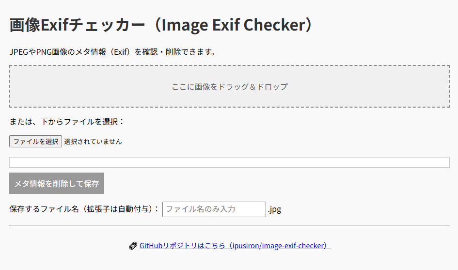
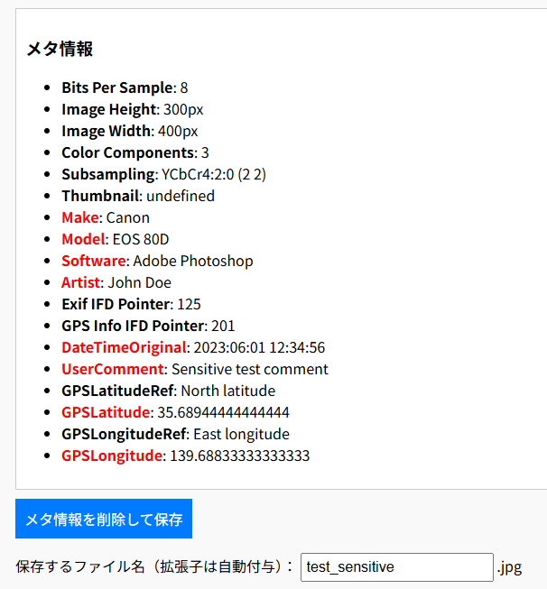

# 画像Exifチェッカー（Image Exif Checker）

**Day 7 - 生成AIで作るセキュリティツール100**

**画像Exifチェッカー**は、JPEG/PNG画像に含まれるExifメタ情報を確認・削除できるWebツールです。  
画像に含まれる位置情報や撮影日時などを可視化し、ボタン1つで除去できます。

## 🌐 デモページ

👉 [https://ipusiron.github.io/image-exif-checker/](https://ipusiron.github.io/image-exif-checker/)

## 📸 スクリーンショット

以下は実際の画面例です。

> 
>
> *画像Exifチェッカーの初期画面*
>
>
>
> *テスト用画像ファイル（"test_sensitive"ファイル）のExif情報を表示した*

## 🔍 機能の概要

- **クライアントサイド完結**であるため、画像はアップロードされません。
- SNS投稿前の**個人情報漏洩リスク**チェックに最適です。

## 🖼 対応形式
- JPEGファイル（.jpg、.jpeg）
- PNGファイル（.png）

## ⚠️ メタ情報クリーナーの注意点

- 本ツールでは、画像をCanvasに再描画することでExif情報を除去しています。
- 削除後の画像ファイルは見た目は同じでも、メタ情報が除去された新しい画像ファイルです。
	- 心配な場合は、生成された画像ファイルを再度画像Exifチェッカーに読み込ませてExif情報を確認してみてください。  
- PNGはExifが標準ではないため、効果が限定的な場合があります。
- ブラウザーやSNSアプリのキャッシュに注意してください。

## 技術詳細

本ツールでは、Exifなどのメタ情報をブラウザ上で完全に削除するため、以下の方法を採用しています。

### ✅ 処理の流れ：

1：入力された画像ファイル（JPEGまたはPNG）を読み込む。

2：HTMLCanvasElementに画像を再描画する。

3：canvas.toBlob()により再圧縮画像として保存用Blobを生成する。

4：メタ情報を含まないクリーンな画像ファイルとしてダウンロード提供する。

この処理により、画像の視覚的内容はそのまま保持されつつ、以下のようなメタ情報はすべて削除されます。

### 🔍 Exif情報の抽出処理について

本ツールでは、画像ファイルに含まれる Exifメタ情報の解析にExifReaderライブラリを使用しています。

画像ファイル（JPEG/PNG）はバイナリ形式として読み込まれ、次のような手順でExif情報が抽出されます。

```
const arrayBuffer = await file.arrayBuffer();
const tags = ExifReader.load(arrayBuffer);
```

 - `file.arrayBuffer()`によって画像ファイルのバイナリデータを取得
 - `ExifReader.load()`を用いて、Exif領域に含まれる各種タグ（カメラ名、撮影日時、GPS座標など）を抽出

抽出されたデータは、descriptionやvalueとしてHTML上に表示され、削除前にどのような個人情報が含まれているかを可視化するために使われます。

### 🧹 削除される主な情報：
| 分類    | 例                                            |
| ----- | -------------------------------------------- |
| 撮影日時  | `DateTimeOriginal`, `CreateDate`             |
| 位置情報  | `GPSLatitude`, `GPSLongitude`, `GPSAltitude` |
| カメラ情報 | `Make`, `Model`, `LensModel`                 |
| 編集履歴  | `Software`, `ModifyDate`                     |
| 著作権情報 | `Copyright`, `Artist`                        |
| その他   | `Orientation`, `ISO`, `ExposureTime` など多数    |

### 📁 出力形式：

- 入力画像が JPEG：Exif除去後も JPEG形式（.jpg） で保存
- 入力画像が PNG：透過情報を保持したまま PNG形式（.png） で保存

※ 形式は自動的に判別され、Exif削除後も元と同じ拡張子で保存されます。

### 🔧 Exif情報の削除の仕組み（Canvas再描画方式）

「画像ファイルCanvasに描画⇒Blobで再生成⇒保存」という処理で、Exif情報を削除しています。

```
canvas.toBlob((blob) => {
  // 新しい画像を保存
}, "image/jpeg", 0.95);
```

　Canvas APIの制限により、入力がPNGファイルでも、出力はJPEGファイルになります。

### ⚠️ 注意事項：

PNG形式は本来Exifをサポートしませんが、一部のアプリケーションでは独自に埋め込むことがあります。本ツールではそのようなメタ情報も除去対象となります。

canvas.toBlob()による再描画時に画像の再エンコードが行われるため、JPEGではごくわずかな品質劣化が発生する可能性があります（デフォルト品質：0.95）。

一部のSNSアプリや画像ビューアでは、Exif情報がキャッシュされていることがあります。削除結果を確認するにはExifビューアなどで再確認をおすすめします。

以下は、`README.md` に追加する「テスト」セクションの記述例です。
`test_sensitive.jpg` および `generate_test_exif_image.ipynb` の**簡潔で実用的な使い方説明**を含めています。


## ✅ テスト

このツールの動作確認には、以下の**テスト用ファイル**を利用できます。
"test"フォルダーに配置してあります。

### 🔹 `test_sensitive.jpg`

* 本リポジトリに含まれる、**Exif情報付きのサンプル画像**です。
* `GPSLatitude`、`DateTimeOriginal`、`Artist` などの**情報漏洩リスクのあるExif項目を含んでいます**。

📌 この画像をツールに読み込ませることで、
該当項目が**赤色で強調表示**されることを確認できます。

### 🔹 `generate_test_exif_image.ipynb`

* テスト画像を自分で生成したい場合は、この**Jupyter Notebook形式のスクリプト**を使用してください。
* `Pillow` + `piexif` により、任意のExif情報を含むJPEG画像をローカルまたはColab上で生成できます。

#### 使用手順（Google Colab推奨）：

1. [`generate_test_exif_image.ipynb`](./test/generate_test_exif_image.ipynb) をColabで開く
2. 各セルを上から順に実行する
3. 生成された `test_sensitive.jpg` をダウンロードして、本ツールに読み込ませる


## 🧠 このツールについて

本ツールは、「生成AIで作るセキュリティツール100」プロジェクトの一環として開発されました。

このプロジェクトでは、AIの支援を活用しながら、セキュリティに関連するさまざまなツールを100日間にわたり制作・公開していく取り組みを行っています。

プロジェクトの詳細や他のツールについては、以下のページをご覧ください。

🔗 [https://akademeia.info/?page_id=42163](https://akademeia.info/?page_id=42163)
